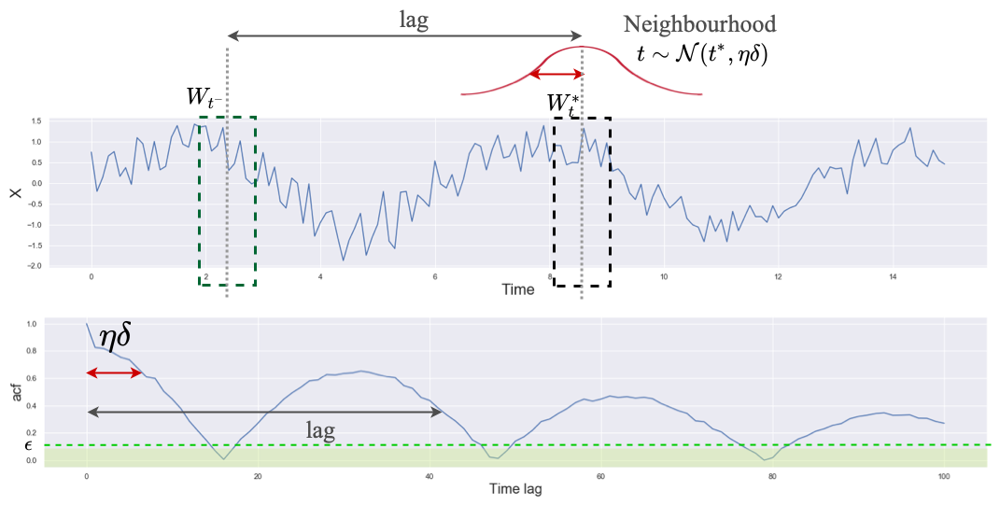

# Learning Unsupervised Representations for ICU Timeseries
with TempoRal AutoCorrelation Encoding (TRACE)

Abstract: Medical time series like physiological signals provide a rich source of information about patients' underlying clinical states. Learning such states is a challenging problem for ML but has great utility for clinical applications. It allows us to identify patients with similar underlying conditions, track disease progression over time, and much more. 
The challenge with medical time series however, is the lack of well-defined labels for a given patient's state for extended periods of time. Collecting such labels is expensive and often requires substantial effort. In this work, we propose an unsupervised representation learning method, called TRACE, that allows us to learn meaningful patient representations from time series collected in the Intensive Care Unit (ICU). We show the utility and generalizability of these representations in identifying different downstream clinical conditions and also show how the trajectory of representations over time exhibits progression toward critical conditions such as cardiopulmonary arrest or circulatory failure. 

Paper Link: https://proceedings.mlr.press/v174/weatherhead22a.html

Experiments were done on 2 datasets. One is a pediatric ICU dataset from The Hospital for Sick Children in Toronto, Ontario, and the other is an ICU dataset from the Department of Intensive Care Medicine of the Bern University Hospital in Switzerland (https://hirid.intensivecare.ai). 

To train our encoder on the HiRID dataset, ensure you are in the root directory of this repo.

'''
python -u -m tnc_for_hyper_param_optimization --train --cont --ID 0000 --plot_embeddings --encoder_type CausalCNNEncoder --window_size 12 --w 0.05 --batch_size 30 --lr .00005 --decay 0.0005 --mc_sample_size 6 --n_epochs 150 --data_type HiRID --n_cross_val_encoder 1 --ETA 4 --ACF_PLUS --ACF_nghd_Threshold 0.6 --ACF_out_nghd_Threshold 0.1 --CausalCNNEncoder_in_channels 36 --CausalCNNEncoder_channels 4 --CausalCNNEncoder_depth 1 --CausalCNNEncoder_reduced_size 2 --CausalCNNEncoder_encoding_size 10 --CausalCNNEncoder_kernel_size 2 --CausalCNNEncoder_window_size 12 --n_cross_val_classification 3 
'''

Note the ID flag can be set to any 4 digit number. This is simply used for bookkeeping different model runs. 

You'll have to modfiy the directories for data in the tnc.py file (e.g. for TEST_mixed_data_maps, etc). Please see the hirid_process.py file for how pre processing is done.

